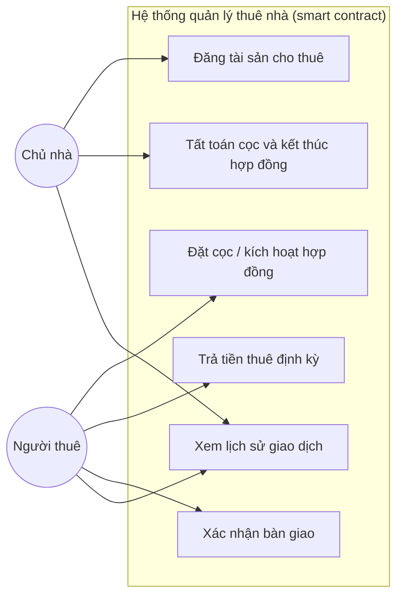
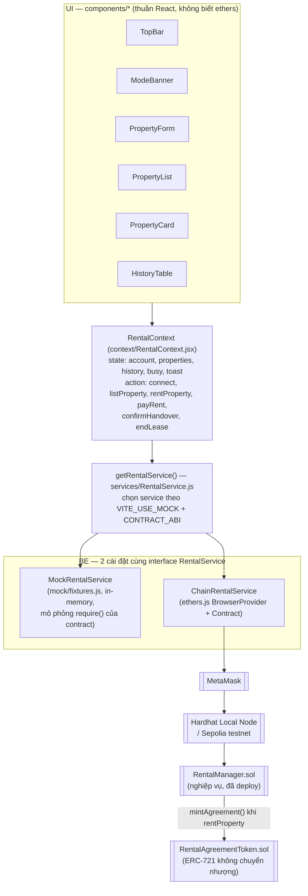
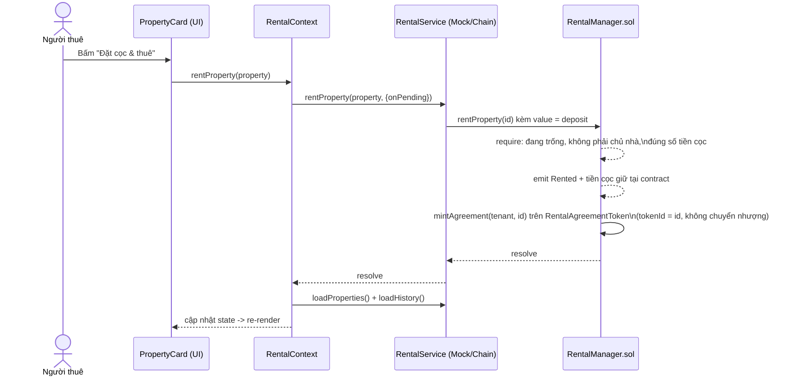
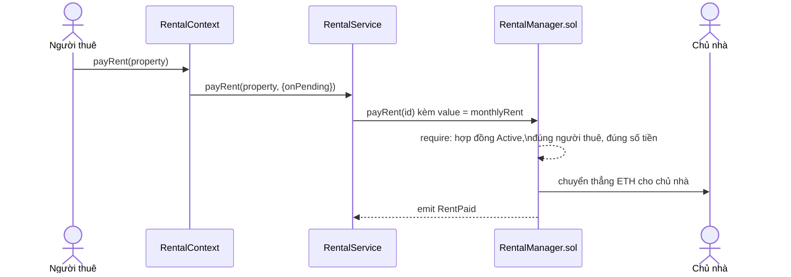
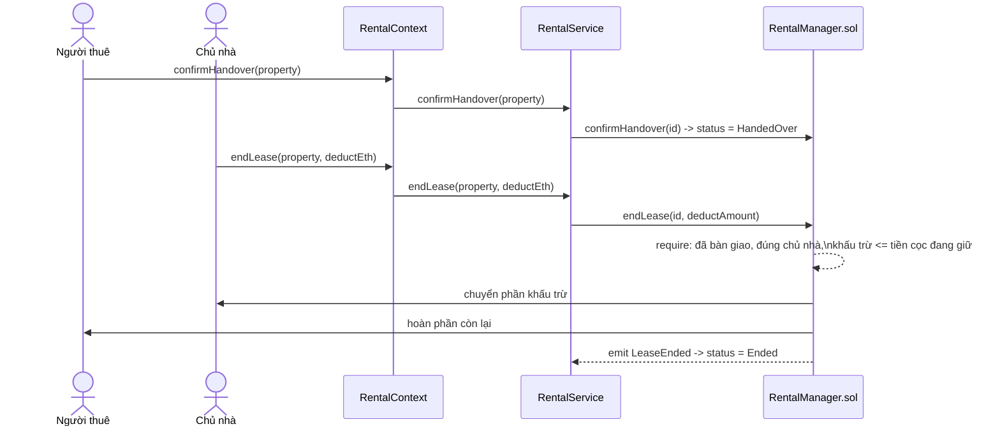

# Use case & kiến trúc hệ thống

## 1. Sơ đồ use case

## 2. Kiến trúc hệ thống

Điểm mấu chốt của bản refactor này: **UI (giao diện) và BE (logic dữ liệu/blockchain)
tách rời hoàn toàn qua một lớp "service"** có 2 cài đặt hoán đổi được — nhờ vậy nhóm có
thể dựng và kiểm tra toàn bộ giao diện bằng dữ liệu mẫu (`MockRentalService`) trước khi
contract được deploy, rồi chuyển sang blockchain thật (`ChainRentalService`) mà **không
sửa bất kỳ component UI nào**.

Frontend chỉ gọi vào `RentalManager` (ABI/hàm/sự kiện giữ nguyên như trước khi tách
contract) — `RentalAgreementToken` là chi tiết triển khai nội bộ giữa 2 contract, không
lộ ra ngoài giao diện. Xem lý do tách 2 contract tại
[docs/lua-chon-token.md](./lua-chon-token.md).

## 3. Sequence diagram — các luồng nghiệp vụ chính

### 3.1. Đặt cọc & kích hoạt hợp đồng

### 3.2. Trả tiền thuê định kỳ

### 3.3. Xác nhận bàn giao & tất toán cọc

## 4. Lựa chọn service (mock ↔ chain)

`getRentalService()` (frontend/src/services/RentalService.js) quyết định dựa trên biến
môi trường `VITE_USE_MOCK` (đọc từ `frontend/.env`, xem `frontend/.env.example`):

| `VITE_USE_MOCK` | Kết quả |
|---|---|
| `true` | Luôn dùng `MockRentalService` — không cần MetaMask/contract, phù hợp khi thiết kế UI. |
| `false` | Luôn dùng `ChainRentalService` — bắt buộc phải có MetaMask + contract đã deploy. |
| không đặt (`auto`, mặc định) | Tự dùng mock nếu `frontend/src/config.js` chưa có ABI (chưa chạy `npm run deploy`), ngược lại dùng chain thật. |
